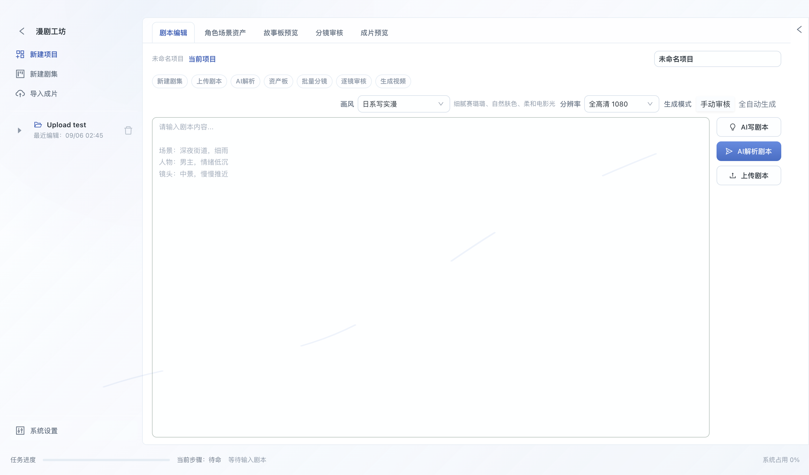

<p align="center">
  <h1 align="center">🎬 ComicAgent · AI 漫剧 Agent</h1>
  <p align="center">
    <strong>输入剧本 → Agent 智能拆解 → 逐镜头生成 → 成片输出</strong>
  </p>
  <p align="center">
    全流程自动化的 AI 漫剧生产桌面工作台，零门槛将故事转化为可发布的漫剧视频。
  </p>
  <br/>
  <p align="center">
    
    <br/>
    <sub><b>桌面客户端（Electron）真实启动界面</b> —— 漫剧工坊主界面：左侧项目与系统入口，中部剧本编辑与多页签工作区，右侧 AI 写剧本 / 解析 / 上传与画风·分辨率·生成模式设置</sub>
  </p>
</p>

---

## 目录

- [核心能力](#核心能力)
- [技术栈](#技术栈)
- [项目结构](#项目结构)
- [架构设计](#架构设计)
  - [五栏工作台布局](#五栏工作台布局)
  - [双运行模式](#双运行模式)
  - [流水线流程](#流水线流程)
  - [视觉一致性系统](#视觉一致性系统)
  - [三层记忆系统](#三层记忆系统)
- [下载安装](#下载安装)
- [快速开始](#快速开始)
  - [前置条件](#前置条件)
  - [后端启动](#后端启动)
  - [前端启动](#前端启动)
- [配置说明](#配置说明)
  - [环境变量](#环境变量)
  - [风格模板](#风格模板)
  - [模型与 API 配置](#模型与-api-配置)
- [API 参考](#api-参考)
  - [项目与剧本](#项目与剧本)
  - [镜头与素材](#镜头与素材)
  - [渲染与导出](#渲染与导出)
  - [设置与系统](#设置与系统)
  - [WebSocket 事件](#websocket-事件)
- [数据模型](#数据模型)
- [测试与验证](#测试与验证)
- [设计系统](#设计系统)
- [已知限制](#已知限制)
- [相关文档](#相关文档)

---

## 核心能力

<table>
<tr><td width="140"><strong>📝 剧本输入</strong></td><td>手工输入、AI 自动生成、上传 <code>.txt</code> / <code>.docx</code> 剧本文件，支持系列项目与多剧集管理</td></tr>
<tr><td><strong>🤖 Agent 流水线</strong></td><td>剧本解析 → 分镜拆解 → 角色三视图 + 场景基准图 → 定稿故事板 → 逐镜头配音 → 逐镜头视频 → 成片合成，全流程自动编排</td></tr>
<tr><td><strong>🎨 素材板</strong></td><td>集中管理角色卡片（6 种情绪变体、服装/配饰锁定）与场景资产（地点+时段分组、光照/道具锁定），可编辑 Prompt 并重新生成</td></tr>
<tr><td><strong>🔒 视觉一致性 SOP</strong></td><td>角色身份、场景光照、场景组隔离、180 度轴线、参考权重、续帧参考、OpenPose/深度图控制——生成阶段强制注入，跨镜头风格统一</td></tr>
<tr><td><strong>⚡ 双运行模式</strong></td><td><b>手动审核模式</b>（默认）：每阶段人工卡点，逐镜头确认质量；<b>全自动模式</b>：LangGraph 端到端 <code>ainvoke</code>，一键出片。两种模式复用同一批步骤函数</td></tr>
<tr><td><strong>🎛️ 系统设置</strong></td><td>内置 8 套画风模板 + 自定义画风；LLM / 图像 / 视频 / 配音四类模型 API 可视化配置；子 Agent Skill 方案保存、导入和项目/剧集绑定</td></tr>
<tr><td><strong>📡 实时进度</strong></td><td>WebSocket 推送阶段进度、镜头更新、故事板就绪、渲染完成等事件，前端实时反馈</td></tr>
<tr><td><strong>🎥 成片导出</strong></td><td>FFmpeg 负责镜头归一化、Ken Burns 动效、转场、色调统一、环境底噪与最终拼接，输出标准 MP4</td></tr>
</table>

---

## 技术栈

| 层级 | 技术 | 版本 | 用途 |
|------|------|------|------|
| 桌面壳 | Electron | 32.x | 桌面窗口、原生文件选择、IPC 通信 |
| 前端框架 | React + TypeScript | 18.3 / 5.6 | 工作台 UI 渲染 |
| 构建工具 | Vite | 5.4 | 开发服务器与生产构建 |
| UI 组件 | Ant Design | 5.20 | 表单、弹窗、选择器、菜单等基础组件 |
| 状态管理 | Zustand | 4.5 | 项目与镜头全局状态 |
| 动效 | GSAP | 3.15 | 界面过渡与微交互 |
| HTTP / 实时 | Axios + WebSocket | — | REST API 调用与任务进度推送 |
| 后端框架 | FastAPI | latest | REST API + WebSocket 服务 |
| Agent 编排 | LangGraph | latest | 自动模式端到端状态图 |
| ORM | SQLAlchemy 2.0 | — | 数据模型与查询 |
| 数据库 | SQLite | — | Demo 阶段零运维本地持久化 |
| LLM | Mimo（小米 MiMo）/ OpenAI 兼容 | — | 剧本生成、剧本解析、分镜决策、自然语言交互 |
| 图像生成 | Seedream（火山方舟）/ Stability / PIL 占位 | — | 角色三视图、场景基准图、定稿故事板 |
| 视频生成 | SeedDance（火山方舟） | 1.5 pro | 首帧图驱动的逐镜头视频生成 |
| 配音 | Mimo 内置 TTS | — | 角色对白语音合成 |
| 渲染 | FFmpeg | — | 成片合成、Ken Burns、转场、混音 |

> 图像生成支持自动回退：配置真实 Provider 且有 API Key 时走云端服务，否则自动使用 PIL 占位图（`IMAGE_PROVIDER=local`），全流程可在无密钥环境端到端跑通。

---

## 项目结构

```text
ComicAgent/
├── client/                              # Electron + React 前端
│   ├── src/
│   │   ├── main/                        # Electron 主进程
│   │   │   ├── main.ts                  # BrowserWindow 创建、IPC 处理
│   │   │   └── preload.ts               # contextBridge 安全 API 暴露
│   │   └── renderer/                    # React 渲染进程
│   │       ├── App.tsx                  # 五栏工作台根布局
│   │       ├── main.tsx                 # React 入口 + Ant Design 主题
│   │       ├── components/
│   │       │   ├── TopBar.tsx           # 顶栏：项目标题、操作按钮、设置入口
│   │       │   ├── LeftSidebar.tsx      # 左栏：项目列表、Agent 流程状态
│   │       │   ├── MainWorkspace.tsx    # 主区：剧本编辑、画面预览、镜头缩略图
│   │       │   ├── RightSidebar.tsx     # 右栏：风格设置、镜头控制、运行日志
│   │       │   ├── BottomBar.tsx        # 底栏：任务进度、时长统计
│   │       │   ├── FlowGraph.tsx        # 自动模式流程图可视化
│   │       │   ├── SystemSettingsPage.tsx # 系统设置全屏页
│   │       │   └── GlobalPlayfulMotion.tsx # 全局微动效
│   │       ├── stores/
│   │       │   ├── projectStore.ts      # 项目状态（ID/标题/风格/分辨率等）
│   │       │   └── shotStore.ts         # 镜头状态（列表/选中/生成进度）
│   │       ├── services/
│   │       │   └── api.ts               # Axios 封装 + WebSocket 工厂
│   │       ├── styles/
│   │       │   └── global.css           # Mac 原生极简设计系统
│   │       ├── theme.ts                 # Ant Design 主题 Token
│   │       └── constants/
│   │           └── styleTemplates.ts    # 前端风格模板常量
│   ├── package.json
│   ├── vite.config.ts                   # Vite + Electron 插件配置
│   └── vite.config.web.ts              # 纯 Web 开发配置（跳过 Electron）
│
├── server/                              # FastAPI 后端
│   ├── main.py                          # 应用入口、CORS、静态输出目录挂载
│   ├── config.py                        # Pydantic Settings 配置管理
│   ├── requirements.txt                 # Python 直接运行依赖
│   ├── requirements.lock                # 带哈希的锁定运行依赖
│   ├── requirements-dev.txt             # 开发与测试直接依赖
│   ├── requirements-dev.lock            # 带哈希的锁定开发依赖
│   ├── .env.example                     # 环境变量模板
│   ├── agent/                           # LangGraph 自动模式
│   │   ├── state.py                     # AgentState TypedDict 定义
│   │   ├── graph.py                     # 自动模式状态图（5 节点线性串联）
│   │   ├── nodes/                       # 图节点实现
│   │   │   ├── script_parser.py         # 剧本解析（LLM）
│   │   │   ├── storyboard_gen.py        # 分镜生成（LLM）
│   │   │   ├── voice_gen.py             # ※ 历史遗留
│   │   │   ├── video_compose.py         # ※ 历史遗留
│   │   │   └── quality_check.py         # ※ 历史遗留
│   │   └── edges/
│   │       └── conditions.py            # 条件路由逻辑
│   ├── api/                             # REST API 与 WebSocket
│   │   ├── websocket.py                 # WebSocket ConnectionManager
│   │   └── routes/
│   │       ├── script.py                # 剧本生成、解析、流水线触发（核心，571 行）
│   │       ├── shot.py                  # 镜头管理、故事板、审核、视频生成（核心，873 行）
│   │       ├── project.py               # 项目 CRUD、剧集管理
│   │       ├── asset.py                 # 素材板（角色/场景资产绑定）
│   │       ├── character.py             # 角色资产 CRUD
│   │       ├── render.py                # 成片渲染导出
│   │       ├── settings.py              # 风格模板、Skill 配置、模型 API 配置
│   │       ├── graph.py                 # 流程图结构（由 build_graph 动态派生）
│   │       └── chat.py                  # 自然语言交互
│   ├── services/                        # 外部服务封装
│   │   ├── llm_service.py               # Mimo/OpenAI 兼容 LLM 调用（含兜底链）
│   │   ├── image_service.py             # 图像生成（Seedream/Stability/PIL 占位，含角色卡片注入）
│   │   ├── video_service.py             # SeedDance 视频生成（异步任务轮询）
│   │   ├── tts_service.py               # Mimo 内置 TTS 配音
│   │   ├── ffmpeg_service.py            # FFmpeg 成片合成（Ken Burns/字幕/转场/混音）
│   │   ├── consistency_service.py       # 视觉一致性 SOP 注入引擎
│   │   ├── reference_asset_service.py   # 参考图/连续帧/OpenPose/深度图物料化
│   │   ├── style_templates.py           # 8 套内置画风模板 + 自定义模板管理
│   │   ├── model_config_service.py      # 模型 API 配置持久化（覆盖 .env）
│   │   ├── skill_config_service.py      # 子 Agent Skill 方案管理
│   │   └── storage_service.py           # 文件存储管理
│   ├── models/                          # SQLAlchemy 数据模型
│   │   ├── base.py                      # DeclarativeBase
│   │   ├── project.py                   # 项目/剧集模型
│   │   ├── shot.py                      # 镜头模型（45+ 字段，含一致性追踪）
│   │   ├── character.py                 # 角色资产模型
│   │   └── scene_asset.py               # 场景资产模型
│   ├── db/
│   │   └── database.py                  # SQLite 连接、建表、增量列补齐迁移
│   ├── memory/                          # 三层记忆系统
│   │   ├── memory_manager.py            # 统一管理器
│   │   ├── project_memory.py            # 项目级记忆（JSON）
│   │   └── user_memory.py               # 用户偏好记忆（JSON）
│   ├── rag/
│   │   └── rag_service.py               # ChromaDB RAG 检索（当前暂停用）
│   ├── prompts/
│   │   └── styles/                      # 风格 Prompt 模板
│   │       ├── anime.json               # 日系动漫
│   │       ├── chinese.json             # 国漫古风
│   │       ├── chibi.json               # Q 版可爱
│   │       └── realistic.json           # 电影写实
│   ├── scripts/                         # 测试与审计脚本
│   │   ├── full_flow_smoke.py           # 全链路冒烟测试
│   │   ├── api_diagnostics.py           # API Key 连通性诊断
│   │   ├── sop_completion_audit.py      # SOP 合规性审计
│   │   ├── sop_payload_smoke.py         # SOP Payload 冒烟检查
│   │   └── iteration_flow_audit.py      # 迭代流程审计
│   └── data/                            # 运行时数据（gitignore）
│       ├── comic_agent.db               # SQLite 数据库
│       ├── model_api_config.json        # 模型 API 配置持久化
│       ├── skill_config_templates.json  # Skill 方案持久化
│       └── custom_style_templates.json  # 自定义画风模板
│
├── output/                              # 生成的项目素材与成片（gitignore）
├── docs/
│   └── FULL_FLOW_TEST.md                # 全链路测试说明
├── PRODUCT.md                           # 产品定位与品牌策略
├── DESIGN.md                            # 设计系统（OKLCH 色彩 + 毛玻璃层次）
└── README.md                            # 本文件
```

---

## 架构设计

### 五栏工作台布局

```
┌──────────────────────────────────────────────────────────┐
│                        TopBar (44px)                      │
│         项目标题    [新建] [导入] [生成] [导出] [设置]       │
├────────────┬──────────────────────────┬───────────────────┤
│            │                          │                   │
│   Left     │     MainWorkspace        │      Right        │
│  Sidebar   │  ┌────────────────────┐  │     Sidebar       │
│  (240px)   │  │    剧本输入区      │  │     (300px)       │
│            │  │    (可编辑文本)    │  │                   │
│  项目列表  │  ├────────────────────┤  │   画风选择        │
│            │  │                    │  │   分辨率/平台     │
│  ────────  │  │    画面预览区      │  │   运行模式切换    │
│  Agent     │  │   (故事板/成片)    │  │   ───────────    │
│  流程状态  │  │                    │  │   镜头详情编辑    │
│  ① 解析   │  ├────────────────────┤  │   镜头类型/情绪   │
│  ② 分镜   │  │ [缩略图1][缩2]...  │  │   机位/运镜/时长  │
│  ③ 故事板 │  │   镜头缩略图条     │  │   ───────────    │
│  ④ 视频   │  └────────────────────┘  │   运行日志        │
│  ⑤ 合成   │                          │                   │
├────────────┴──────────────────────────┴───────────────────┤
│                     BottomBar (32px)                       │
│   进度条 ████░░░░ 40%  │  预估剩余 2:30  │  总时长 1:45    │
└──────────────────────────────────────────────────────────┘
```

| 组件 | 尺寸 | 核心职责 |
|------|------|---------|
| `TopBar` | 44px 全宽 | 项目标题显示、新建/导入/生成/导出操作按钮、系统设置入口 |
| `LeftSidebar` | 240px | 项目列表（支持系列/剧集切换）、Agent 5 步流水线状态指示灯 |
| `MainWorkspace` | flex:1 | 剧本编辑区（32%）+ 画面预览区（flex:1）+ 镜头缩略图拖拽排序条 |
| `RightSidebar` | 300px 可折叠 | 画风/分辨率/平台选择、Agent 运行模式、镜头详情编辑表单、运行日志 |
| `BottomBar` | 32px 全宽 | 任务进度条、当前步骤提示、预估剩余时间、总时长统计 |
| `SystemSettingsPage` | 全屏 | 画风模板管理、模型 API 可视化配置、Skill 方案管理 |

### 双运行模式

```text
┌─────────────────────────────────────────────────────────┐
│                    手动审核模式（默认）                     │
│                                                         │
│  输入剧本                                                │
│    ↓  POST /api/script/parse (mode=manual)               │
│  阶段1: 剧本解析 + 分镜列表 + 角色三视图 + 场景基准图      │
│    ↓  WebSocket: complete → 人工确认素材                  │
│  阶段2: 逐镜头定稿故事板参考图                             │
│    ↓  WebSocket: storyboard_ready → 人工逐镜头审核        │
│  阶段3: 逐镜头配音 + SeedDance 视频                       │
│    ↓  WebSocket: shot_update（逐镜头完成）                │
│  阶段4: FFmpeg 成片合成                                   │
│    ↓  WebSocket: render_complete → 成片可播放             │
│                                                         │
│  特点：每步有人工卡点，适合对成品质量有要求的创作流程       │
└─────────────────────────────────────────────────────────┘

┌─────────────────────────────────────────────────────────┐
│                    全自动模式（LangGraph）                  │
│                                                         │
│  POST /api/script/parse (mode=auto)                      │
│    ↓  get_graph().ainvoke(state)                         │
│  START → parse_and_storyboard                            │
│       → generate_storyboard_images                       │
│       → auto_approve_storyboard                          │
│       → generate_shot_videos                             │
│       → compose → END                                    │
│                                                         │
│  特点：一键端到端，中途无人工卡点，适合快速验证和批量出片  │
│        任意节点失败即短路至 END，经 WebSocket 上报错误     │
└─────────────────────────────────────────────────────────┘
```

> **关键设计**：两种模式的步骤函数完全复用。自动模式图节点（`agent/graph.py`）只是薄包装，惰性 import 并调用 `api/routes/` 中手动模式的同一批函数，新增/修改流程逻辑只需改一处。`/api/graph/structure` 由已编译图动态派生，前端流程图可视化与真实执行器保持一致。

### 流水线流程

```text
用户输入剧本 → 点击"生成分镜"
  │
  ├─ 1. projectApi.create()         → 创建项目，获得 projectId
  ├─ 2. createWebSocket(projectId)  → 建立 WS 连接，监听进度
  └─ 3. scriptApi.parse(text, mode) → 提交剧本，触发后端 Agent 流水线
       │
       ├─ WS: progress              → 更新进度条 + 当前步骤名称
       ├─ WS: complete              → 写入分镜列表，刷新素材板
       ├─ WS: shot_update           → 单镜头故事板/音频/视频就绪
       ├─ WS: storyboard_ready      → 故事板全部生成完毕
       ├─ WS: render_complete       → 成片合成完成，返回 video_url
       └─ WS: error                 → 流水线错误，显示错误信息
```

每步异步执行（`asyncio.create_task`），不阻塞 API 响应。WebSocket 客户端每 30 秒发送 `ping` 保持连接。

### 视觉一致性系统

后端通过 `ConsistencyService` 维护跨图像与视频生成的强制一致性规则：

| 规则 | 内容 |
|------|------|
| **角色卡片** | 视觉 Prompt、关键特征（key_features）、6 种情绪变体（neutral/happy/shy/sad/angry/surprised）、固定种子、服装/化妆/配饰锁定 |
| **场景组** | 按"地点 + 时段"分组，锁定色温、光源方向、强度、天气、透视、LUT、道具位置；日夜场景严格隔离 |
| **参考权重** | wide / medium / close-up 使用不同的环境与动作参考权重 |
| **续帧** | 同场景组内优先使用上一镜头末帧（last_frame_path）作为连续性参考 |
| **控制参考** | 复杂动作时派生 OpenPose 风格边缘图（pose_reference_path）与深度图（depth_reference_path），随 SeedDance 请求加载 |
| **审核闸门** | 视频生成前必须存在已审核的故事板参考图；镜头编辑后清空下游故事板、音频、视频与连续帧产物，防止不一致传播 |
| **转场规则** | 同场景硬切或 0.2s 淡入淡出；跨场景 0.3-0.5s 白色闪光或推拉；环境底噪连续不截断 |

### 三层记忆系统

| 层级 | 载体 | 生命周期 | 内容 |
|------|------|---------|------|
| 工作记忆 | LangGraph AgentState | 单次流水线 | 节点间数据传递、分镜列表、生成进度 |
| 项目记忆 | JSON 文件 | 项目生命周期 | 角色卡片、风格参数、剧情上下文、生成偏好 |
| 用户记忆 | JSON 文件 | 永久 | 用户偏好、常用修正模式、操作习惯 |

---

## 下载安装

桌面安装包已内置完整运行时（自包含 CPython 3.11 + 全部后端依赖 + 静态 FFmpeg），**无需安装 Python、pip 依赖或 FFmpeg**，下载后开箱即用：

| 平台 | 安装包 | 说明 |
|------|--------|------|
| macOS（Apple Silicon） | `ComicAgent-<版本>-mac-arm64.dmg` | dmg 拖入 Applications，或解压 zip |
| macOS（Intel） | `ComicAgent-<版本>-mac-x64.dmg` | 同上 |
| Windows（x64） | `ComicAgent-<版本>-win-x64.exe` | NSIS 安装器，另有绿色版 zip |

从 [GitHub Releases](https://github.com/robiteame/ComicAgent/releases) 获取最新版本；每次打 `v*` 标签会自动构建全部三个平台并发布。发布流水线自带安全门禁：先跑完整 CI 测试矩阵，再校验签名凭据，产物附 SBOM 与 sha256 校验文件（`SHA256SUMS-<os>.txt`，可用 `shasum -a 256 --check` 验证）。

### 发布前需配置的仓库 Secrets

正式 Release 必须签名与公证，缺少以下任意 Secret 时打标签会直接失败（防止误发未签名安装包）：

| Secret | 用途 |
|--------|------|
| `CSC_LINK` / `CSC_KEY_PASSWORD` | macOS Developer ID 证书（p12 base64 + 密码） |
| `APPLE_ID` / `APPLE_APP_SPECIFIC_PASSWORD` / `APPLE_TEAM_ID` | macOS 公证（notarization） |
| `WIN_CSC_LINK` / `WIN_CSC_KEY_PASSWORD` | Windows Authenticode 代码签名证书 |

### macOS 首次启动（仅本地/未签名构建）

本地自行构建或内测 dry-run 产物未做开发者签名与公证，首次打开会被 Gatekeeper 拦截（“无法验证开发者”）。两种绕过方式任选：

```bash
# 方式一：命令行清除隔离属性（推荐）
xattr -cr /Applications/ComicAgent.app

# 方式二：右键 -> 打开 -> 再点“打开”；或在 系统设置 -> 隐私与安全性 中点“仍要打开”
```

### Windows 首次启动（SmartScreen，仅本地/未签名构建）

未签名 exe 会触发 SmartScreen 蓝色警告：点击 **“更多信息” → “仍要运行”** 即可继续安装。

> 正式 Release 一经配置上述 Secrets 即自动签名 + 公证；第三方组件来源与许可见安装包内 `Resources/THIRD-PARTY-NOTICES.md`。

---

## 快速开始

### 前置条件

| 依赖 | 版本要求 | 验证命令 |
|------|---------|---------|
| Python | ≥ 3.11 | `python3 --version` |
| Node.js | ≥ 22.13 | `node --version` |
| pnpm | 11.15.1 | `pnpm --version` |
| FFmpeg | 可用的系统版本 | `ffmpeg -version` |

> **FFmpeg 安装**：macOS 推荐 `brew install ffmpeg`；Windows 从 [ffmpeg.org](https://ffmpeg.org/download.html) 下载并添加到 PATH；Linux 使用包管理器安装。

### 后端启动

```bash
cd server

# 1. 创建虚拟环境
python3 -m venv .venv
source .venv/bin/activate        # Windows: .venv\Scripts\activate

# 2. 按锁文件安装可复现的运行依赖
python -m pip install --require-hashes -r requirements.lock

# 3. 配置环境变量（可选，无 API Key 时图像阶段使用 PIL 占位图）
cp .env.example .env
# 编辑 .env 填入 API Key

# 4. 启动服务（默认端口 8011）
python main.py
# 或: uvicorn main:app --host 0.0.0.0 --port 8011 --reload
```

启动后可访问：
- API 文档：http://127.0.0.1:8011/docs
- 健康检查：http://127.0.0.1:8011/health
- 输出文件：http://127.0.0.1:8011/output/{path}

### 前端启动

**纯 Web 开发模式**（推荐，无需 Electron）：

```bash
# 在仓库根目录统一安装 workspace 依赖
pnpm install --frozen-lockfile
pnpm --dir client exec vite --config vite.config.web.ts --host 127.0.0.1 --port 5173
```

打开 http://127.0.0.1:5173 即可使用。

> 项目中已包含 `vite.config.web.ts`，跳过 Electron 插件，避免因 Electron 二进制下载失败而无法启动。

**完整 Electron 桌面端开发**：

```bash
# 在仓库根目录执行
pnpm install --frozen-lockfile
pnpm --dir client run electron:dev    # 自动启动后端 + Vite + Electron 窗口
```

> 如遇 Electron 二进制下载超时，项目 `.npmrc` 已配置国内镜像源。也可先使用纯 Web 模式开发。

### 桌面窗口外观

桌面壳使用透明窗口 + 系统级玻璃材质，叠加渲染层白色渐变蒙版，形成白色磨砂玻璃观感：

| 平台 | 实现 |
|------|------|
| Windows 11 | `backgroundMaterial: 'acrylic'`，系统亚克力磨砂 |
| macOS | `titleBarStyle: 'hiddenInset'` 悬浮红绿灯 + `vibrancy: 'under-window'`（`visualEffectState: 'active'`）系统磨砂，顶部拖拽条加高为 28px |

macOS 上 CSS `backdrop-filter` 无法模糊桌面，因此由系统 vibrancy 负责磨砂、
渲染层 `.app-shell` 的白色蒙版负责着色；暗色主题下蒙版自动切换为深色渐变。

### Electron 发布包

`pnpm --dir client run build:local` 完成桌面安装包的一键本地构建：先由
`client/scripts/build-python-runtime.mjs` 组装可重定位运行时，再经 Vite 与 electron-builder
打包。安装包内 `Resources/`（Windows 为 `resources\`）布局：

```text
server/   # 过滤后的 Python 源码（排除 .venv/.env/data 运行数据/测试残留）
python/   # python-build-standalone CPython 3.11 + 按 requirements.lock 预装的 site-packages
bin/      # 钉死版本的静态 ffmpeg（含 libx264，渲染必需）
```

运行时构建脚本的要点：

- 所有外部下载（PBS 运行时、ffmpeg）**钉死版本 + sha256 校验**，缓存于 `client/build/cache/`，重复构建幂等跳过，`--clean` 可整体清理；
- 依赖用 `uv pip install --python <捆绑解释器> --require-hashes -r server/requirements.lock` 直接装入 PBS 前缀（**不创建 venv**，PBS 按二进制位置解析 prefix，天然可重定位，脚本内含 relocation 自检）；uv 不可用时自动回退 `ensurepip + pip`；
- 主进程打包态优先 spawn `Resources/python/` 内的解释器，并把 `Resources/bin` 注入 `PATH` 头部使 FFmpeg 命中捆绑二进制；`COMIC_AGENT_PYTHON` 环境变量仍可强制覆盖；开发态（`electron:dev`）行为不变。

本地 API Key、SQLite 数据库、上传文件和缓存不会被打包；后端运行数据写入 Electron
`userData` 目录。

推送 `v*` 标签时 `.github/workflows/release.yml` 会在 macOS（arm64/x64）与 Windows（x64）
runner 上成套构建三个平台的安装包并发布到 GitHub Releases（当前为未签名构建）；
也可通过 `workflow_dispatch` 以 `--publish never` 干跑验证流水线。

开发与 CI 的完整依赖使用 `server/requirements-dev.lock` 安装；两个锁文件均要求
`python -m pip install --require-hashes -r <lockfile>`，更新直接依赖后需要重新生成锁文件。

---

## 配置说明

### 环境变量

所有配置项定义在 `server/config.py`（Pydantic Settings），可通过 `.env` 文件或环境变量覆盖。配置优先级：**应用内保存的模型配置 > .env 文件 > config.py 默认值**。

完整模板见 `server/.env.example`。其中**运行生成流程必须配置**的是 `MIMO_API_KEY`（剧本/分镜 LLM，或改用 `OPENAI_API_KEY`）与 `ARK_API_KEY`（视频生成）；其余项都有可用默认值：图像默认走 `local` 占位图，服务端口、数据库路径、渲染参数等均可留空。模板中的占位 Key 一律留空，避免被程序误判为「已配置」。

#### LLM 配置

| 变量 | 默认值 | 说明 |
|------|--------|------|
| `LLM_PROVIDER` | `openai` | LLM 提供商：`openai` / `deepseek` / `mimo`（推荐 `mimo`，见下方 Mimo 配置） |
| `OPENAI_API_KEY` | — | OpenAI API Key |
| `OPENAI_BASE_URL` | — | OpenAI 兼容接口地址 |
| `OPENAI_MODEL` | `gpt-4o` | OpenAI 模型名称 |
| `MIMO_API_KEY` | — | Mimo API Key（小米 MiMo 官方接口）；**生成流程必填**，留空则剧本解析直接报错 |
| `MIMO_BASE_URL` | `https://token-plan-cn.xiaomimimo.com/v1` | Mimo 接口地址 |
| `MIMO_MODEL` | `mimo-v2.5` | Mimo 模型名称 |
| `MIMO_MULTIMODAL_MODEL` | `mimo-v2-omni` | 图像理解/诊断用多模态模型 |
| `LLM_MAX_TOKENS` | `4096` | LLM 最大输出 Token 数 |

#### 图像生成配置

| 变量 | 默认值 | 说明 |
|------|--------|------|
| `IMAGE_PROVIDER` | `local` | 图像生成提供商：`local`（PIL 占位图）/ `stability` / `doubao-seedream-5.0-lite` |
| `STABILITY_API_KEY` | — | Stability AI API Key |
| `STABILITY_API_URL` | `https://api.stability.ai/v2beta` | Stability API 地址 |
| `ARK_API_KEY` | — | 火山方舟 API Key（Seedream 图像 + SeedDance 视频共用）；**视频生成必填** |
| `SEEDREAM_API_KEY` | — | Seedream 专用 API Key |
| `SEEDREAM_MODEL` | `doubao-seedream-5.0-lite` | Seedream 模型 |
| `SEEDREAM_IMAGE_SIZE` | `1440x2560` | 默认出图尺寸（宽x高） |

> `IMAGE_PROVIDER=local` 或缺少对应 API Key 时，系统自动使用 PIL 生成纯色占位图，图像阶段可离线跑通。但剧本解析、配音和视频生成仍需对应 API Key。

#### 视频生成配置

| 变量 | 默认值 | 说明 |
|------|--------|------|
| `VIDEO_PROVIDER` | `Doubao-Seedance-1.5-pro` | 视频生成提供商 |
| `SEEDDANCE_API_KEY` | — | SeedDance 专用 API Key（可选，留空回退 `ARK_API_KEY`） |
| `SEEDDANCE_BASE_URL` | `https://ark.cn-beijing.volces.com/api/v3` | SeedDance API 地址 |
| `SEEDDANCE_MODEL` | `doubao-seedance-1-5-pro-251215` | SeedDance 模型 |

#### TTS 配音配置

| 变量 | 默认值 | 说明 |
|------|--------|------|
| `MIMO_TTS_MODEL` | `mimo-v2.5-tts` | Mimo TTS 模型 |
| `MIMO_TTS_VOICE` | `冰糖` | 默认音色 |
| `MIMO_TTS_FORMAT` | `wav` | 音频格式 |
| `TTS_PROVIDER` | `mimo` | 历史字段，仅保留兼容；配音固定走 Mimo 内置 TTS（复用 `MIMO_API_KEY` + `MIMO_BASE_URL`） |
| `TTS_DEFAULT_VOICE` | `zh-CN-XiaoyiNeural` | 历史字段（旧 edge-tts 音色名），已被 `MIMO_TTS_VOICE` 取代 |

#### 渲染与数据库配置

| 变量 | 默认值 | 说明 |
|------|--------|------|
| `PORT` | `8011` | 后端服务端口 |
| `DEFAULT_FPS` | `24` | 默认视频帧率 |
| `DEFAULT_RESOLUTION` | `1080p` | 默认输出分辨率 |
| `DATABASE_URL` | `sqlite:///server/data/comic_agent.db` | 数据库连接串 |

### 风格模板

内置 8 套预置画风模板（`server/prompts/styles/` + `server/services/style_templates.py`），支持自定义添加：

| 模板 Key | 中文标签 | 风格描述 |
|----------|---------|---------|
| `anime` | 日系写实漫 | 新海诚风格，柔和光影，高饱和色彩 |
| `chinese` | 国漫厚涂 | 中国传统美学，水墨笔触，浓郁中国风 |
| `chibi` | 简约条漫 | Q 版大头，可爱圆润，简洁线条 |
| `realistic` | 电影写实 | 电影级质感，真实光影，胶片调色 |
| `watercolor` | 水彩绘本 | 水彩晕染，柔和笔触，梦幻治愈 |
| `ink` | 新国风水墨 | 水墨意境，留白布局，禅意东方 |
| `noir` | 悬疑电影感 | 暗调高对比，霓虹灯光，氛围感 |
| `clay` | 定格黏土 | 黏土质感，手工定格动画风格 |

每套模板含 `prompt_prefix`、`negative_prompt`、`style_label`、`scene_baseline_prompt`、`character_reference_prompt` 等完整参数，由 `ConsistencyService` 注入生成流程。

### 模型与 API 配置

应用内"系统设置 → 模型与 API 配置"提供可视化界面修改 LLM / 图像 / 视频 / 配音四类模型配置，保存后覆盖 `.env` / 默认值，持久化到 `server/data/model_api_config.json`，新任务立即读取最新配置。

> ⚠️ `server/data/model_api_config.json` 会明文保存 API Key，属于本地运行时配置，**不应提交到版本库**。若该文件已进入 Git 历史，请立即轮换相关密钥并从历史记录中清除。

### 模型价格与预算

"系统设置 → 模型价格"按能力配置单价（LLM 每 100 万 tokens、图像每张、视频每秒、TTS 每 1000 字符、FFmpeg 每分钟编码），支持次级单价（LLM 输出 token）与分辨率倍率；"项目 → 预算面板"配置软/硬预算（金额与时长）并实时显示已用成本、已预留额度、剩余工作量的预计成本与预计耗时。

记账口径（全项目统一）：

- 金额一律是**货币最小单位的整数倍**（本项目管理到 10^-6 个货币单位，1 CNY = 1_000_000 micro），任何一步都用整数运算并向上取整，**不存在浮点金额**；
- 没有可用价目的调用记为 `cost_known=false` 且金额为 NULL，界面显示"成本未知"，绝不按 0 元或猜测价格入账（本地占位图与本地 FFmpeg 是已知的零外部费用，单独标记为 `local`）；
- **估算与实际分开存储**：启动前的估算写 `cost_estimates`，每次真实调用写 `usage_records`，两者互不覆盖；
- 任务完成、失败、取消、被服务重启中断都会保留已发生的调用成本，任务中心可按任务查看明细；
- 软预算超出只提示，硬预算超出会以 `error_code=budget_exceeded`（HTTP 409）阻止新任务启动；并发任务按"已用 + 已预留 + 本次估算"比对，预留随任务结束释放，不会重复计费。

---

## API 参考

### 项目与剧本

| 方法 | 路径 | 说明 |
|------|------|------|
| `POST` | `/api/project` | 创建项目。`project_type=series` 时自动创建第一集 episode |
| `GET` | `/api/project` | 获取项目列表（支持 `?parent_id=` 过滤剧集） |
| `GET` | `/api/project/{id}` | 获取项目详情（含镜头数量、剧集信息） |
| `PUT` | `/api/project/{id}` | 更新项目信息（标题、风格、分辨率等） |
| `DELETE` | `/api/project/{id}` | 删除项目及关联的所有资产和输出文件 |
| `POST` | `/api/project/{id}/import-video` | 导入外部成片视频 |
| `GET` | `/api/project/{id}/episodes` | 获取系列项目的剧集列表 |
| `POST` | `/api/script/generate` | AI 自动生成完整漫剧剧本 |
| `POST` | `/api/script/parse` | 提交剧本并触发流水线。`mode=manual`（默认）或 `mode=auto` |
| `POST` | `/api/script/upload` | 上传 `.txt` / `.docx` 剧本文件并触发流水线 |

### 镜头与素材

| 方法 | 路径 | 说明 |
|------|------|------|
| `GET` | `/api/shot/{project_id}/shots` | 获取项目镜头列表（按 sequence 排序） |
| `PUT` | `/api/shot/{shot_id}` | 修改镜头参数（场景描述、运镜、情绪等），自动失效下游产物并增加版本号 |
| `POST` | `/api/shot/{shot_id}/regenerate` | 重新生成单个镜头故事板 |
| `POST` | `/api/shot/batch-regenerate` | 批量重新生成镜头故事板 |
| `GET` | `/api/shot/{shot_id}/generation-prompt` | 获取镜头完整生成 Prompt（含一致性注入结果，调试用） |
| `POST` | `/api/shot/{project_id}/generate-storyboard` | 批量生成定稿故事板参考图 |
| `POST` | `/api/shot/{shot_id}/approve-storyboard` | 单镜头故事板审核通过 |
| `POST` | `/api/shot/{project_id}/confirm-storyboard` | 批量确认全部故事板 |
| `POST` | `/api/shot/{shot_id}/generate-video` | 单镜头配音 + SeedDance 视频生成 |
| `GET` | `/api/asset/{project_id}/board` | 获取素材板（角色 + 场景资产列表） |
| `PUT` | `/api/asset/shot/{shot_id}` | 重新绑定镜头的场景/角色资产 |
| `PUT` | `/api/asset/character/{character_id}` | 更新角色资产（Prompt、外观、服装锁定等） |
| `PUT` | `/api/asset/scene/{scene_id}` | 更新场景资产 |

### 渲染与导出

| 方法 | 路径 | 说明 |
|------|------|------|
| `POST` | `/api/render` | 触发成片合成（需 body: `{project_id, output_format, resolution}`） |
| `GET` | `/api/render/{project_id}/status` | 查询持久化的渲染任务状态 |

### 设置与系统

| 方法 | 路径 | 说明 |
|------|------|------|
| `GET` `POST` | `/api/settings/style-templates` | 画风模板列表 / 新建自定义模板 |
| `GET` `POST` | `/api/settings/skill-configs` | Skill 方案列表 / 保存方案 |
| `PUT` | `/api/settings/skill-configs/bindings` | Skill 方案绑定（全局 / 项目 / 剧集） |
| `GET` `PUT` | `/api/settings/model-configs` | 模型 API 配置读取 / 保存 |
| `GET` | `/api/graph/structure` | 获取自动模式流程图结构（节点+边，含中文标签和描述） |
| `POST` | `/api/chat` | 自然语言交互（返回操作建议和项目/镜头上下文） |

### 成本、用量与预算

| 方法 | 路径 | 说明 |
|------|------|------|
| `GET` `PUT` | `/api/budget/pricing` | 模型价格配置读取 / 保存（金额为整数 micro，浮点被拒绝） |
| `GET` `PUT` | `/api/budget/config` | 项目 / 全局预算配置读取 / 保存（软预算、硬预算、时长预算） |
| `GET` | `/api/budget/status` | 项目预算状态（已用 / 已预留 / 限额 / 状态等级） |
| `POST` | `/api/budget/estimate` | 提交前估算：任务成本、预计耗时（含来源）、逐项拆解、是否会被硬预算拦下 |
| `GET` | `/api/budget/summary` | 项目 / 剧集页所需的已用成本、剩余预计成本与耗时、各剧集成本表 |
| `GET` | `/api/budget/usage` | 实际用量明细与多维度统计（项目 / 剧集 / 镜头 / 任务类型 / 能力 / provider / 模型） |
| `GET` | `/api/budget/jobs/{job_id}` | 单次任务的成本明细：实际调用记录 + 启动前估算（失败 / 取消的任务同样可查） |

> 提交类接口（`/api/script/parse`、`/api/script/upload`、`/api/shot/{pid}/generate-storyboard`、`/api/shot/{sid}/generate-video`、`/api/render`）在软预算超支时会在响应里附带 `budget_warning`；硬预算超限时返回 HTTP 409，`detail.error_code = budget_exceeded`。

### WebSocket 事件

**连接**：`ws://127.0.0.1:8011/ws/{project_id}`

**服务端推送事件**：

| 事件类型 | 触发时机 | Payload 关键字段 |
|----------|---------|-----------------|
| `progress` | 流水线步骤进度变化 | `step`, `progress`（0-100）, `message` |
| `complete` | 阶段 1 完成（解析+分镜+素材） | `project_id`, `shots[]`, `asset_board_ready` |
| `shot_update` | 单镜头产物更新 | `shot_id`, `status`, `image_path`, `storyboard_path`, `audio_path`, `video_path` |
| `storyboard_ready` | 全部故事板生成完成 | `project_id` |
| `render_complete` | 成片渲染完成 | `video_url`, `duration` |
| `error` | 流水线错误 | `message` |

**进度步骤顺序**：`parse_script` → `generate_storyboard` → `wait_asset_confirm` → `generate_storyboard_images` → `wait_storyboard_approval` → `generate_voice` → `generate_seedance_video` → `rendering`

---

## 数据模型

### 实体关系

```
Project (项目/剧集)
├── 1:N → Shot (分镜镜头)
├── 1:N → Character (角色资产)
├── 1:N → SceneAsset (场景资产)
└── 1:N → UsageRecord (实际用量) / CostEstimate (启动前估算)

Project (series) ──parent_project_id──▶ Project (episode)
   剧集复用父项目的角色卡片和场景基准图

BudgetConfig (预算：全局 / 项目 / 剧集)
BudgetReservation (任务启动时按估算预留的额度)
PricingConfig (各能力单价，按 capability + provider + model 匹配)
```

### 关键字段说明

**Project** — 支持 `series`（系列）和 `episode`（剧集）两种类型，剧集通过 `parent_project_id` 复用父项目素材。包含 `output_format`（9:16/16:9/1:1）、`resolution`（720p/1080p/4k）、`platform`（douyin/kuaishou/bilibili/custom）等渲染参数。

**Shot** — 核心模型（45+ 字段），除基础镜头属性外，含有大量一致性追踪字段：`consistency_context`（一致性 SOP 快照）、`reference_weights`（参考权重配置）、`continuity_profile`（连续帧配置）、`continuity_reference_path`（上一帧末帧）、`pose_reference_path`（OpenPose 边缘图）、`depth_reference_path`（深度图）。

**Character** — 角色资产，包含 `visual_prompt`（英文绘画 Prompt）、`emotion_variants`（6 种情绪→Prompt 映射）、`key_features`（关键视觉特征 JSON）、`wardrobe_lock`（服装锁定）、`reference_images`（已确认参考图列表）。

**SceneAsset** — 场景资产，通过 `scene_group_key`（地点+时段）分组实现场景组隔离，`consistency_profile` 锁定光照/色温/透视，`prop_lock` 锁定道具。

**PricingConfig** — 单价表：`capability`（llm/image/video/tts/ffmpeg）+ `provider`（协议名）+ `model`（空串 = 该 provider 通用价）；`unit_price_micro` / `unit_price_secondary_micro`（LLM 输出 token）、`resolution_multipliers`（整数倍率，1_000_000 = 1.0）、`configured`。匹配优先级：model 精确 > provider 通用 > 能力兜底，只有 `configured=true` 且单价非空的行才参与计费。

**UsageRecord** — 一次真实供应商调用的用量与费用：`usage_key`（唯一，重复写入不会重复计费）、归属（`project_id` / `series_id` / `shot_id` / `job_id` / `job_type` / `job_status`）、`capability` + `provider` + `model`、`quantity` / `secondary_quantity`（token / 张 / 秒 / 字符）、`units`（明细）、`status`（succeeded/failed/cancelled）、`cost_micro` + `cost_known` + `cost_source` + `price_snapshot`、`duration_ms`（供应商调用耗时）。

**CostEstimate** — 任务启动前的估算（与 UsageRecord 分表）：`estimated_cost_micro` / `cost_known` / `estimated_seconds` / `duration_source`（history/heuristic/unknown）、`components`（逐能力拆解）与 `unknown_components`（哪些环节没有单价）。

**BudgetConfig / BudgetReservation** — 预算（`soft_cost_micro` / `hard_cost_micro` / `soft_seconds` / `hard_seconds`，按 `scope_type` + `scope_id` 唯一）与任务启动时按估算预留的额度（`reservation_key` 唯一，任务终结即释放，保证并发下硬预算依然拦得住）。

---

## 测试与验证

### 后端检查

```bash
cd server

# 首次准备开发环境
python -m pip install --require-hashes -r requirements-dev.lock

# 语法检查
python -m compileall .

# 回归测试
python -m pytest -q

# 离线流程审计
python scripts/iteration_flow_audit.py      # 迭代流程审计
python scripts/sop_completion_audit.py       # SOP 合规性审计
python scripts/sop_payload_smoke.py          # SOP Payload 冒烟检查

# API 连通性诊断（不打印 Key）
python scripts/api_diagnostics.py

# 全链路冒烟测试（需后端已启动 + 真实 API 配置）
python scripts/full_flow_smoke.py
```

全链路测试成功标志为 `FULL_FLOW_OK`，覆盖：Agent 剧本生成 → 分镜列表 → 故事板参考图 → 镜头编辑 → 审核确认 → 逐镜头视频 → 成片合成 → 输出验证。

### 前端检查

```bash
# 在仓库根目录执行
pnpm install --frozen-lockfile

# TypeScript 类型检查
pnpm --dir client run typecheck

# 构建检查
pnpm --dir client run build:web
```

---

## 设计系统

项目采用 Mac 原生极简设计风格，核心设计理念参见 [DESIGN.md](DESIGN.md)。

- **色彩**：OKLCH 色彩空间，天际蓝（`oklch(0.55 0.15 250)`）作为品牌识别色，毛玻璃面板构建空间层次
- **字体**：`"Noto Sans SC", -apple-system, "SF Pro Text", system-ui, sans-serif`
- **层次**：四级毛玻璃层级体系（纯白底 → blur 12px 面板 → blur 20px 浮层 → blur 24px 弹出）
- **动效**：200ms ease-out 过渡，300ms ease-out-quart 页面切换
- **产品定位**：以创作为中心，镜头是核心操作单位；自然语言交互优于表单操作；预览即时反馈

---

## 已知限制

- **端口固定使用 `127.0.0.1`**：避免 Windows / Electron 下 `localhost` 解析异常。后端 `8011`，前端 `5173`
- **自动模式进度跳变**：自动模式复用手动模式的 WebSocket 进度百分比，数值可能出现跳变，属已知外观问题
- **SeedDance 单次 5 秒**：SeedDance 1.5 pro 单次生成固定 5 秒时长视频
- **分辨率降级**：2K / 4K 项目分辨率在视频生成时会降级为 1080p 调用，最终剪辑时由 FFmpeg 按镜头时长归一化
- **RAG 暂停使用**：`chromadb` 与 `sentence-transformers` 依赖已在 `requirements.txt` 中注释，代码保留可随时启用
- **重复解析保护**：已有已确认/已出片镜头的项目再次解析会被拒绝，避免误删既有成果
- **无独立数据库迁移工具**：列级增量补齐在 `db/database.py::_ensure_sqlite_columns()` 中完成
- **Electron 下载问题**：国内网络可能超时，项目 `.npmrc` 已配置镜像源；纯 Web 开发模式（`vite.config.web.ts`）可绕过此问题

---

## 相关文档

| 文档 | 内容 |
|------|------|
| [PRODUCT.md](PRODUCT.md) | 产品定位、目标用户、品牌策略、战略原则 |
| [DESIGN.md](DESIGN.md) | 设计系统：OKLCH 色彩、毛玻璃层次、字体、动效规范 |
| [client/CLAUDE.md](client/CLAUDE.md) | 前端技术文档：组件架构、状态管理、API 封装、Electron 配置 |
| [server/CLAUDE.md](server/CLAUDE.md) | 后端技术文档：流水线架构、双运行模式、服务层、数据模型、API 参考 |
| [docs/FULL_FLOW_TEST.md](docs/FULL_FLOW_TEST.md) | 全链路测试说明：启动、冒烟测试、手动 UI 验收、常用校验命令 |
